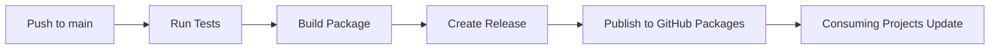

# Migration Guide: From Git Dependencies to NPM Packages

## 🎯 Overview

This guide explains how to migrate from git dependencies to proper npm package management using GitHub Packages.

## 📋 Current vs. Future State

### Current State (Git Dependencies)
```json
{
  "dependencies": {
    "@marcopersi/shared": "git+https://github.com/marcopersi/goldsphere-shared.git"
  }
}
```

### Future State (NPM Packages)
```json
{
  "dependencies": {
    "@marcopersi/shared": "^1.0.0"
  }
}
```

## 🚀 Migration Steps

### 1. Setup Authentication for GitHub Packages

Create `.npmrc` in your consuming projects:
```bash
@marcopersi:registry=https://npm.pkg.github.com
//npm.pkg.github.com/:_authToken=${GITHUB_TOKEN}
```

### 2. Set Environment Variable

For local development:
```bash
export GITHUB_TOKEN=your_personal_access_token
```

For CI/CD:
```yaml
env:
  GITHUB_TOKEN: ${{ secrets.GITHUB_TOKEN }}
```

### 3. Update package.json in Consuming Projects

Replace git dependency:
```json
{
  "dependencies": {
    "@marcopersi/shared": "^1.0.0"
  }
}
```

### 4. Install Dependencies
```bash
npm install
```

## 🔄 Version Management Workflow

### For Maintainers (goldsphere-shared repo):

1. **Make changes** to the shared library
2. **Create a release** using one of these methods:

   **Option A: Manual Release**
   ```bash
   npm run release:patch  # for bug fixes
   npm run release:minor  # for new features  
   npm run release:major  # for breaking changes
   ```

   **Option B: GitHub UI**
   - Go to GitHub → Releases → Create new release
   - Tag follows semver: `v1.0.1`, `v1.1.0`, `v2.0.0`
   - CI/CD automatically publishes

3. **Package is automatically built and published** to GitHub Packages

### For Consumers (other projects):

1. **Update dependency version** in package.json:
   ```bash
   npm update @marcopersi/shared
   ```

2. **Or specify exact version**:
   ```bash
   npm install @marcopersi/shared@1.2.0
   ```

## 🏗️ Architecture Benefits

### Before (Git Dependencies)
- ❌ Must commit `dist/` files to git
- ❌ Large repository size
- ❌ No proper versioning
- ❌ Consuming projects pull entire git history
- ❌ No dependency caching

### After (NPM Packages)
- ✅ Clean git repository (no build files)
- ✅ Proper semantic versioning
- ✅ Fast dependency installation
- ✅ Better caching in CI/CD
- ✅ Rollback capabilities
- ✅ Automated publishing

## 🔧 CI/CD Workflow



## 💡 Best Practices

1. **Use Semantic Versioning**:
   - `1.0.1` - Bug fixes
   - `1.1.0` - New features (backward compatible)
   - `2.0.0` - Breaking changes

2. **Release Notes**:
   - Document breaking changes
   - List new features
   - Include migration guides

3. **Testing**:
   - Test in consuming projects before releasing
   - Use pre-release versions for testing: `1.1.0-beta.1`

## 🎯 Next Steps

1. ✅ Remove `dist/` from git (already configured)
2. ✅ CI/CD pipeline ready
3. 🔄 Migrate consuming projects one by one
4. 🔄 Create first release: `v1.0.0`
5. 🔄 Update project dependencies

## 📞 Support

For questions or issues with migration, contact the API team.
